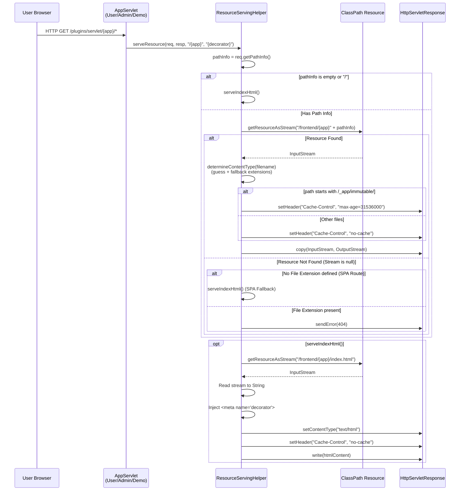

```mermaid
sequenceDiagram
    participant User as User Browser
    participant Servlet as AppServlet<br/>(User/Admin/Demo)
    participant Helper as ResourceServingHelper
    participant ClassLoader as ClassPath Resource
    participant Response as HttpServletResponse

    User->>Servlet: HTTP GET /plugins/servlet/{app}/*
    Servlet->>Helper: serveResource(req, resp, "/{app}", "{decorator}")

    Helper->>Helper: pathInfo = req.getPathInfo()

    alt pathInfo is empty or "/"
        Helper->>Helper: serveIndexHtml()
    else Has Path Info
        Helper->>ClassLoader: getResourceAsStream("/frontend/{app}" + pathInfo)

        alt Resource Found
            ClassLoader-->>Helper: InputStream
            Helper->>Helper: determineContentType(filename)<br/>(guess + fallback extensions)

            alt path starts with /_app/immutable/
                Helper->>Response: setHeader("Cache-Control", "max-age=31536000")
            else Other files
                Helper->>Response: setHeader("Cache-Control", "no-cache")
            end

            Helper->>Response: copy(InputStream, OutputStream)

        else Resource Not Found (Stream is null)
            alt No File Extension defined (SPA Route)
                Helper->>Helper: serveIndexHtml() (SPA Fallback)
            else File Extension present
                Helper->>Response: sendError(404)
            end
        end
    end

    opt serveIndexHtml()
        Helper->>ClassLoader: getResourceAsStream("/frontend/{app}/index.html")
        ClassLoader-->>Helper: InputStream
        Helper->>Helper: Read stream to String
        Helper->>Helper: Inject <meta name="decorator">
        Helper->>Response: setContentType("text/html")
        Helper->>Response: setHeader("Cache-Control", "no-cache")
        Helper->>Response: write(htmlContent)
    end
```
