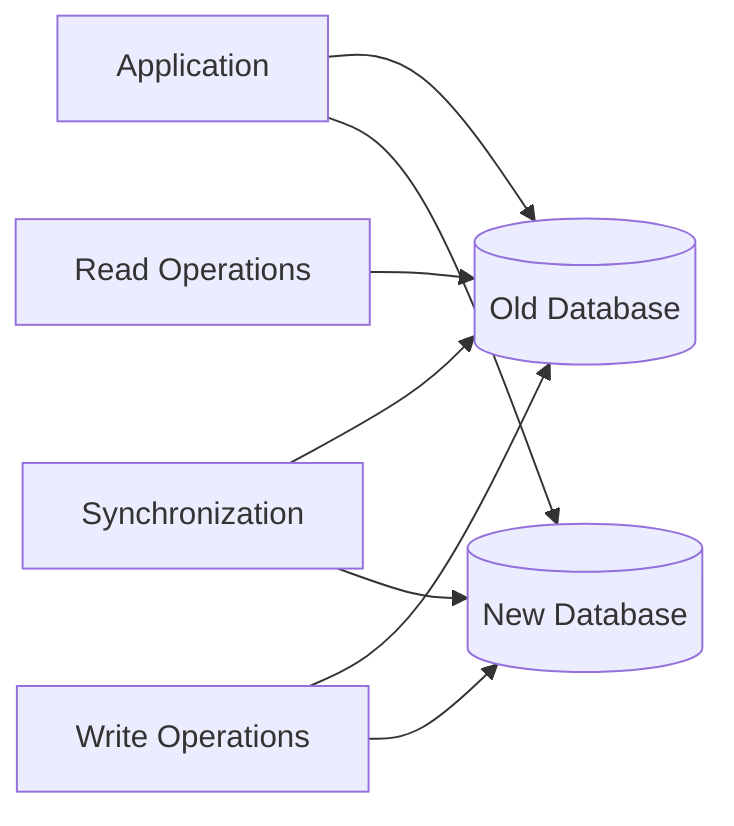
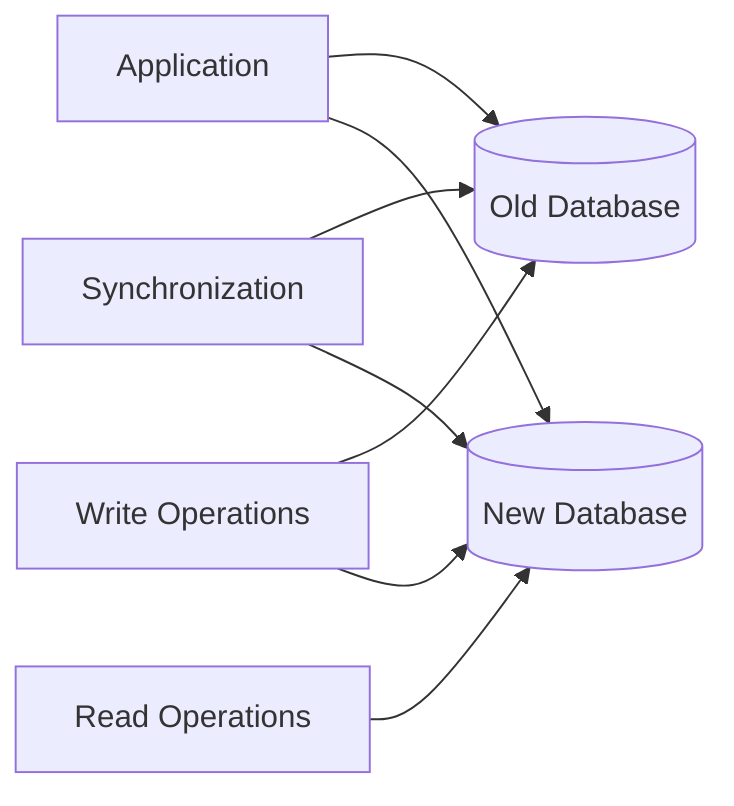
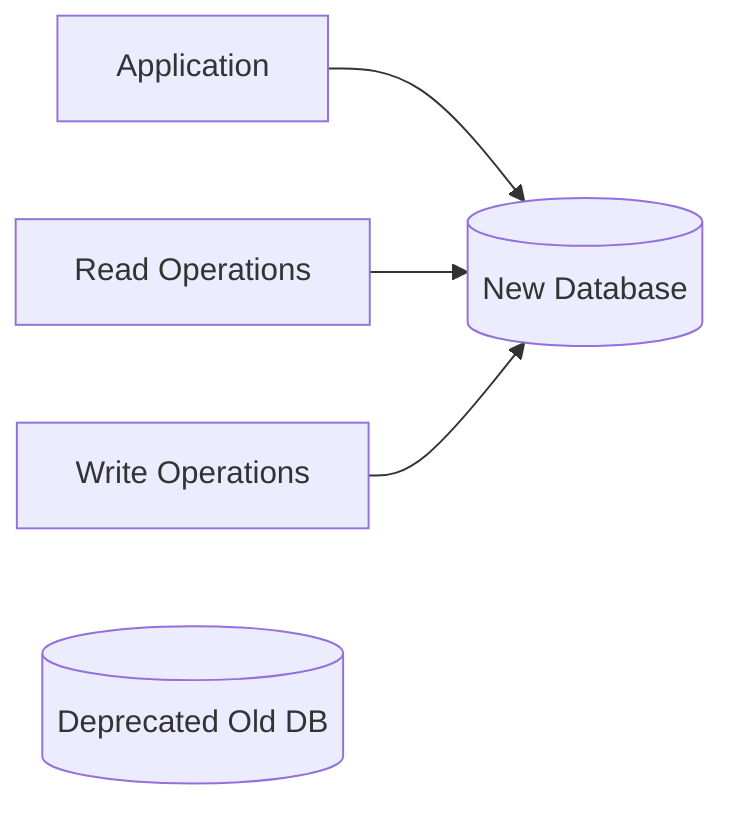

# Confluence Elastic Search - 마이크로서비스 전환 계획

## 🎯 프로젝트 개요

Confluence Data Center 환경의 Elastic Search 플러그인을 현재 **Multi-SPA 아키텍처**에서 **마이크로서비스 아키텍처**로 전환하는 종합 계획입니다.

> **목표**: 분산 시스템을 통한 확장성, 유연성, 장애 내성 극대화

## 📊 아키텍처 비교 분석

### 현재 아키텍처 (Multi-SPA)
```
📦 단일 JAR 플러그인
├── 🎨 Frontend: User App + Admin App (SvelteKit)
├── ⚙️ Backend: 단일 Java Spring Boot 애플리케이션
├── 🗄️ Database: 단일 PostgreSQL
└── 🚀 Deployment: 단일 Confluence 플러그인
```

### 목표 아키텍처 (마이크로서비스)
```
🕸️ 분산 마이크로서비스 클러스터
├── 🌐 API Gateway (Kong/Traefik)
├── 🔍 Search Service (Node.js/Express)
├── 👤 User Service (Java/Spring Boot)
├── ⚙️ Admin Service (Go/Fiber)
├── 📊 Analytics Service (Python/FastAPI)
├── 🗄️ Databases: PostgreSQL + Elasticsearch + ClickHouse
└── 🏗️ Infrastructure: Kubernetes + Service Mesh
```

## 🏗️ 서비스 분해 전략

### 1. 도메인 기반 서비스 분리

#### 1.1 🔍 Search Service (검색 서비스)

**📋 책임 범위:**
- Elasticsearch 클러스터 관리 및 최적화
- 검색 쿼리 처리 및 실시간 검색
- 검색 결과 랭킹 및 필터링 알고리즘
- 검색 인덱스 관리 및 유지보수

**🛠️ 기술 스택:**
```typescript
// Node.js 기반 고성능 검색 서비스
{
  framework: "Express.js + TypeScript",
  searchEngine: "Elasticsearch 8.x",
  caching: "Redis + Node-cache",
  testing: "Jest + Supertest",
  container: "Docker (Alpine Linux)",
  monitoring: "Prometheus + Jaeger"
}
```

#### 1.2 👤 User Service (사용자 서비스)

**📋 책임 범위:**
- 사용자 인증 및 권한 부여 (JWT/OAuth)
- 사용자 프로필 및 환경 설정 관리
- 역할 기반 접근 제어 (RBAC)
- 세션 관리 및 토큰 처리

**🛠️ 기술 스택:**
```java
// Java/Spring 기반 보안 중심 서비스
{
  framework: "Spring Boot 3.x",
  security: "Spring Security + JWT",
  database: "PostgreSQL + JPA/Hibernate",
  testing: "JUnit 5 + Testcontainers",
  monitoring: "Spring Actuator + Micrometer"
}
```

#### 1.3 ⚙️ Admin Service (관리 서비스)

**📋 책임 범위:**
- 시스템 설정 및 구성 관리
- 실시간 모니터링 및 메트릭 수집
- 관리자 대시보드 및 보고서 생성
- 시스템 상태 모니터링 및 알림

**🛠️ 기술 스택:**
```go
// Go 기반 고성능 관리 서비스
{
  framework: "Gin Web Framework",
  database: "PostgreSQL + GORM",
  config: "Viper + envconfig",
  testing: "Go testing + Testify",
  monitoring: "Go kit + Prometheus"
}
```

#### 1.4 📊 Analytics Service (분석 서비스)

**📋 책임 범위:**
- 실시간 사용 통계 수집 및 분석
- 검색 패턴 및 트렌드 분석
- 비즈니스 인텔리전스 대시보드
- 데이터 시각화 및 자동화 보고서

**🛠️ 기술 스택:**
```python
// Python 기반 데이터 분석 서비스
{
  framework: "FastAPI + Pydantic",
  database: "ClickHouse (시계열 최적화)",
  processing: "Pandas + NumPy",
  ml: "Scikit-learn + TensorFlow",
  monitoring: "FastAPI monitoring + Grafana"
}
```

## 📅 4개월 실행 로드맵

### **Month 1: 기반 구축 및 첫 번째 서비스 분리**

#### Week 1-2: 🏗️ 인프라 구축
- [x] **Kubernetes 클러스터 설정**
  - Minikube/Local 환경 구성
  - Helm 차트 템플릿 준비
  - 서비스 디스커버리 및 DNS 설정

- [x] **API Gateway 도입**
  - Kong 또는 Traefik 설치 및 구성
  - 기본 라우팅 규칙 및 로드 밸런싱
  - 인증/인가 미들웨어 설정

- [x] **모니터링 스택 구축**
  - Prometheus + Grafana 설치
  - Jaeger 분산 추적 시스템 설정
  - ELK Stack 로그 중앙화 구축

#### Week 3-4: 🔍 Search Service 분리
- [x] **Search Service 추출**
  - 현재 검색 코드 독립 분리
  - 새로운 Git 저장소 생성 및 CI/CD 설정
  - Docker 컨테이너화 및 이미지 최적화

- [x] **데이터베이스 분리**
  - Elasticsearch 클러스터 구축 및 구성
  - 데이터 마이그레이션 전략 수립
  - 이중 쓰기 패턴 구현 및 테스트

- [x] **통합 테스트 및 검증**
  - API Gateway 라우팅 검증
  - 데이터 동기화 및 일관성 테스트
  - 성능 벤치마킹 및 부하 테스트

### **Month 2: 👤 User와 ⚙️ Admin 서비스 분리**

#### Week 5-6: 👤 User Service 분리
- [ ] **User Service 추출 및 구축**
  - 사용자 관리 로직 독립 분리
  - JWT 기반 인증 시스템 구현
  - 세션 관리 및 캐싱 전략 구축

- [ ] **보안 강화 및 컴플라이언스**
  - OAuth 2.0/OpenID Connect 구현
  - API 키 관리 및 로테이션 시스템
  - Rate Limiting 및 DDoS 방어

#### Week 7-8: ⚙️ Admin Service 분리 및 통합
- [ ] **Admin Service 구축**
  - 관리자 기능 독립 분리
  - 설정 관리 API 및 인터페이스 구현
  - 모니터링 대시보드 및 알림 시스템 구축

- [ ] **전체 시스템 통합 테스트**
  - 서비스 간 통신 및 API 호출 검증
  - 데이터 일관성 및 트랜잭션 테스트
  - 장애 복구 및 롤백 시나리오 테스트

### **Month 3: 📊 Analytics 서비스 및 고도화**

#### Week 9-10: 📊 Analytics Service 구축
- [ ] **Analytics Service 개발**
  - 실시간 분석 엔진 및 파이프라인 구현
  - 대시보드 API 및 데이터 집계 구축
  - 이벤트 기반 데이터 수집 시스템

- [ ] **이벤트 기반 아키텍처 도입**
  - Apache Kafka 메시지 큐 구축
  - 이벤트 소싱 패턴 구현
  - CQRS (Command Query Responsibility Segregation) 적용

#### Week 11-12: 🚀 성능 최적화 및 보안 강화
- [ ] **캐싱 전략 및 성능 최적화**
  - Redis 클러스터 구축 및 다중 레벨 캐싱
  - 데이터베이스 쿼리 최적화 및 인덱싱
  - CDN 및 정적 자원 최적화

- [ ] **보안 강화 및 컴플라이언스**
  - mTLS (상호 TLS) 및 서비스 메시 보안
  - API Gateway 보안 정책 및 WAF
  - 감사 로그 및 실시간 모니터링

### **Month 4: 🌐 운영 환경 구축 및 마이그레이션**

#### Week 13-14: 🏭 프로덕션 환경 구축
- [ ] **프로덕션 Kubernetes 클러스터**
  - AWS EKS 또는 GCP GKE 프로덕션 환경 구축
  - GitOps 기반 CI/CD 파이프라인 구축
  - Blue-Green 배포 전략 및 카나리 배포 구현

- [ ] **운영 자동화 및 모니터링**
  - 중앙화된 로깅 및 메트릭 시스템 완성
  - 분산 추적 및 APM (Application Performance Monitoring)
  - 자동화된 알림 및 인시던트 대응 시스템

#### Week 15-16: 🎯 최종 마이그레이션 및 안정화
- [ ] **점진적 트래픽 마이그레이션**
  - 카나리 배포 전략 적용 및 트래픽 분배
  - A/B 테스트 및 기능 플래그 기반 전환
  - 롤백 계획 수립 및 재해 복구 테스트

- [ ] **운영 안정화 및 최적화**
  - 성능 튜닝 및 리소스 최적화
  - 보안 취약점 최종 점검 및 패치
  - 사용자 교육 및 문서화 완료

## 🛠️ 기술 스택 및 인프라 상세

### API Gateway 구성 (Kong/Traefik)
```yaml
# Kong 설정 예시
services:
  - name: search-service
    url: http://search-service:3000
    routes:
      - paths: ["/api/search"]
        methods: ["GET", "POST"]
    plugins:
      - name: rate-limiting
        config:
          minute: 1000
      - name: cors

  - name: user-service
    url: http://user-service:8080
    routes:
      - paths: ["/api/user"]
        methods: ["GET", "POST", "PUT"]
    plugins:
      - name: jwt
      - name: request-transformer
```

### 서비스 간 통신 패턴
```typescript
// Service-to-Service 통신 구현
interface ServiceClient {
  async callService<T>(
    serviceName: string,
    endpoint: string,
    options: RequestOptions
  ): Promise<T>;
}

class ResilientServiceClient implements ServiceClient {
  private circuitBreaker: CircuitBreaker;
  private retryPolicy: RetryPolicy;

  async callService<T>(
    serviceName: string,
    endpoint: string,
    options: RequestOptions
  ): Promise<T> {
    return this.circuitBreaker.execute(async () => {
      return this.retryPolicy.execute(async () => {
        const response = await fetch(
          `${this.getServiceUrl(serviceName)}${endpoint}`,
          {
            ...options,
            headers: {
              ...options.headers,
              'Authorization': `Bearer ${await this.getServiceToken()}`,
              'X-Request-ID': generateRequestId()
            }
          }
        );

        if (!response.ok) {
          throw new ServiceCommunicationError(
            `Service ${serviceName} unavailable`,
            response.status
          );
        }

        return response.json();
      });
    });
  }
}
```

### 데이터베이스 아키텍처 설계
```sql
-- 서비스별 데이터베이스 분리 전략
-- User Service Database
CREATE DATABASE user_service_db;
CREATE TABLE users (
  id UUID PRIMARY KEY,
  email VARCHAR(255) UNIQUE NOT NULL,
  profile JSONB,
  created_at TIMESTAMP DEFAULT NOW(),
  updated_at TIMESTAMP DEFAULT NOW()
);

-- Admin Service Database
CREATE DATABASE admin_service_db;
CREATE TABLE system_configs (
  key VARCHAR(255) PRIMARY KEY,
  value JSONB,
  updated_by UUID,
  updated_at TIMESTAMP DEFAULT NOW()
);

-- Analytics Service Database (ClickHouse)
CREATE TABLE analytics.search_events (
  timestamp DateTime,
  user_id String,
  query String,
  results_count UInt32,
  response_time_ms UInt32,
  user_agent String,
  ip_address String
) ENGINE = MergeTree()
PARTITION BY toYYYYMM(timestamp)
ORDER BY (timestamp, user_id)
TTL timestamp + INTERVAL 1 YEAR;
```

## 🔄 데이터 마이그레이션 전략

### 1. 점진적 마이그레이션 패턴

#### Phase 1: 이중 쓰기 (Dual Write)


#### Phase 2: 읽기 전환 (Read Switch)


#### Phase 3: 완전 전환 (Full Switch)


### 2. 데이터 일관성 보장 전략

#### Saga 패턴 구현
```typescript
interface SagaStep {
  execute(context: SagaContext): Promise<void>;
  compensate(context: SagaContext): Promise<void>;
}

class SearchIndexingSaga {
  private steps: SagaStep[] = [
    new ValidateSearchQueryStep(),
    new IndexDocumentStep(),
    new UpdateSearchIndexStep(),
    new NotifySubscribersStep()
  ];

  async execute(searchRequest: SearchRequest): Promise<void> {
    const context = new SagaContext(searchRequest);

    for (const step of this.steps) {
      try {
        await step.execute(context);
      } catch (error) {
        // 보상 트랜잭션 실행
        await this.compensate(context, step);
        throw error;
      }
    }
  }

  private async compensate(context: SagaContext, failedStep: SagaStep): Promise<void> {
    const reversedSteps = [...this.steps].reverse();

    for (const step of reversedSteps) {
      if (step === failedStep) break;
      await step.compensate(context);
    }
  }
}
```

## 📊 비용 및 리스크 분석

### 1. 💰 비용 추정 및 분석

| 구분 | 금액 | 비율 | 설명 |
|------|------|------|------|
| **인프라 구축** | ₩30,000,000 | 25% | K8s, API Gateway, 모니터링 |
| **서비스 분리 개발** | ₩50,000,000 | 42% | 4개 서비스 개발 및 테스트 |
| **테스트 및 QA** | ₩20,000,000 | 17% | 통합 테스트, 성능 테스트 |
| **교육 및 문서화** | ₩10,000,000 | 8% | 팀 교육, 문서 작성 |
| **컨설팅 및 지원** | ₩10,000,000 | 8% | 외부 전문가 자문 |
| **총계** | **₩120,000,000** | **100%** | 4개월 프로젝트 |

### 2. 📈 운영 비용 변화 예측

| 항목 | 현재 | 전환 후 | 증가율 | 연간 영향 |
|------|------|--------|--------|----------|
| **Kubernetes 클러스터** | ₩0 | ₩800,000 | 신규 | ₩9,600,000 |
| **모니터링 도구** | ₩0 | ₩500,000 | 신규 | ₩6,000,000 |
| **데이터베이스 다중화** | ₩500,000 | ₩800,000 | +60% | ₩3,600,000 |
| **운영 복잡성** | ₩1,000,000 | ₩1,900,000 | +90% | ₩10,800,000 |
| **기타 인프라** | ₩500,000 | ₩500,000 | 0% | ₩6,000,000 |
| **합계** | **₩2,000,000** | **₩3,500,000** | **+75%** | **₩36,000,000** |

### 3. 🎯 ROI 분석 (투자 수익률)

| 기간 | 투자 비용 | 절감 효과 | 순 효과 | 누적 ROI |
|------|-----------|----------|--------|----------|
| **1년차** | ₩120,000,000 | ₩95,000,000 | -₩25,000,000 | -21% |
| **2년차** | ₩0 | ₩120,000,000 | ₩120,000,000 | +67% |
| **3년차** | ₩0 | ₩145,000,000 | ₩145,000,000 | +108% |
| **4년차** | ₩0 | ₩170,000,000 | ₩170,000,000 | +142% |
| **5년차** | ₩0 | ₩195,000,000 | ₩195,000,000 | +163% |

## ⚠️ 리스크 평가 및 완화 전략

### 1. 🚨 기술적 리스크

| 리스크 | 영향도 | 확률 | 완화 전략 |
|--------|--------|------|----------|
| **분산 시스템 복잡성** | 높음 | 중간 | 서킷 브레이커, 재시도 로직, 서비스 메시 |
| **데이터 일관성 문제** | 높음 | 높음 | Saga 패턴, 이벤트 소싱, CQRS 적용 |
| **네트워크 오버헤드** | 중간 | 중간 | 서비스 메시 최적화, 캐싱 전략 |
| **서비스 디스커버리 실패** | 중간 | 낮음 | Kubernetes DNS, Consul 백업 |
| **컨테이너 오케스트레이션** | 높음 | 낮음 | 철저한 테스트, 블루-그린 배포 |

### 2. 🏢 운영 리스크

| 리스크 | 영향도 | 확률 | 완화 전략 |
|--------|--------|------|----------|
| **장애 전파** | 높음 | 중간 | 격벽 패턴, 헬스 체크, 자동 복구 |
| **모니터링 복잡성** | 중간 | 높음 | 중앙화된 모니터링, 자동화된 알림 |
| **배포 복잡성** | 중간 | 중간 | GitOps, 카나리 배포, 롤백 자동화 |
| **팀 역량 부족** | 높음 | 중간 | 사전 교육, 외부 컨설팅, 점진적 도입 |
| **보안 취약점** | 높음 | 낮음 | 제로 트러스트, mTLS, 정기 보안 감사 |

### 3. 📋 리스크 완화 실행 계획

#### Phase 1: 사전 준비 (Week 1-2)
- [ ] 팀 역량 평가 및 교육 계획 수립
- [ ] 기술 스택 PoC (Proof of Concept) 수행
- [ ] 인프라 요구사항 정의 및 벤더 선정

#### Phase 2: 모니터링 구축 (Week 3-4)
- [ ] 분산 추적 시스템 구축
- [ ] 중앙화된 로깅 시스템 구현
- [ ] 자동화된 모니터링 및 알림 설정

#### Phase 3: 점진적 전환 (Week 5-16)
- [ ] 카나리 배포 전략 적용
- [ ] 기능 플래그 기반 기능 전환
- [ ] A/B 테스트를 통한 안정성 검증
- [ ] 자동화된 롤백 시스템 구축

## 🎯 성공 지표 및 KPI

### 1. 📈 기술적 KPI

| 지표 | 현재 수준 | 목표 수준 | 측정 방법 |
|------|-----------|-----------|----------|
| **가용성** | 99.9% | 99.95% | 서비스 uptime 모니터링 |
| **응답 시간** | 200ms | 200ms | 95th percentile 측정 |
| **확장성** | 1배 | 10배 | 부하 테스트 결과 |
| **배포 빈도** | 주 1회 | 일 2회 | CI/CD 파이프라인 메트릭 |

### 2. 💼 비즈니스 KPI

| 지표 | 현재 수준 | 목표 수준 | 측정 방법 |
|------|-----------|-----------|----------|
| **개발 생산성** | 기준 | +40% | 스토리 포인트/주 |
| **운영 비용** | ₩2M/월 | ₩2.5M/월 | 클라우드 비용 분석 |
| **사용자 만족도** | 기준 | NPS 70+ | 사용자 설문조사 |
| **시장 대응 속도** | 기준 | +60% | 기능 출시 주기 |

### 3. 🔍 모니터링 KPI

| 지표 | 목표 수준 | 측정 방법 |
|------|-----------|----------|
| **MTTR** | <5분 | 인시던트 대응 시간 |
| **배포 성공률** | >99% | CI/CD 성공률 |
| **테스트 커버리지** | >85% | 자동화된 테스트 |
| **보안 취약점** | 0건 | 정기 보안 스캔 |

## 🚀 구현 우선순위 및 단계

### Phase 1: 🎯 핵심 인프라 (Week 1-4)
1. **Kubernetes 클러스터 구축**
   - 로컬 개발 환경 설정
   - 프로덕션 환경 준비
   - Helm 차트 템플릿 개발

2. **API Gateway 및 서비스 메시 설정**
   - Kong/Traefik 설치 및 구성
   - Istio 서비스 메시 구축
   - 트래픽 라우팅 및 보안 정책

3. **모니터링 및 관측성 인프라**
   - Prometheus + Grafana 구축
   - Jaeger 분산 추적 설정
   - ELK 스택 로그 중앙화

4. **Search Service 분리**
   - 기존 검색 로직 독립
   - Elasticsearch 클러스터 구축
   - API 게이트웨이 통합

### Phase 2: 🔄 서비스 확장 (Week 5-8)
1. **User Service 분리**
   - 인증/인가 로직 추출
   - 데이터베이스 스키마 분리
   - API 통합 및 테스트

2. **Admin Service 분리**
   - 관리 기능 독립
   - 모니터링 대시보드 구축
   - 설정 관리 API 개발

3. **데이터베이스 분리**
   - 서비스별 스키마 설계
   - 마이그레이션 전략 수립
   - 데이터 일관성 보장

4. **통합 테스트 완료**
   - E2E 테스트 자동화
   - 성능 및 부하 테스트
   - 장애 복구 시나리오 검증

### Phase 3: ⚡ 고도화 (Week 9-12)
1. **Analytics Service 구축**
   - 실시간 분석 엔진 개발
   - 데이터 수집 파이프라인 구축
   - 대시보드 API 구현

2. **이벤트 기반 아키텍처 도입**
   - Kafka 메시지 큐 구축
   - 이벤트 소싱 패턴 적용
   - CQRS 아키텍처 구현

3. **캐싱 및 성능 최적화**
   - Redis 클러스터 구축
   - 다중 레벨 캐싱 전략
   - 데이터베이스 최적화

4. **보안 강화**
   - mTLS 및 서비스 메시 보안
   - API Gateway 보안 정책
   - 감사 로그 시스템

### Phase 4: 🌟 운영화 (Week 13-16)
1. **프로덕션 환경 구축**
   - 클라우드 인프라 구축 (AWS EKS/GCP GKE)
   - GitOps 기반 CI/CD 파이프라인
   - 블루-그린 배포 전략 구현

2. **CI/CD 파이프라인 완성**
   - 자동화된 빌드 및 테스트
   - 카나리 배포 및 롤백 시스템
   - 보안 스캔 및 컴플라이언스 체크

3. **점진적 마이그레이션**
   - 트래픽 라우팅 전략
   - 데이터 마이그레이션 실행
   - 사용자 영향 최소화

4. **운영 안정화**
   - 성능 모니터링 및 튜닝
   - 보안 취약점 최종 점검
   - 팀 교육 및 문서화 완료

## 📝 결론 및 권장사항

### 🎯 마이크로서비스 전환의 핵심 가치

1. **🏗️ 독립적 확장**: 각 서비스별 리소스 최적화 및 수평 확장
2. **🛠️ 기술 다양화**: 서비스별 최적 기술 스택 선택 가능
3. **🛡️ 장애 격리**: 하나의 서비스 실패가 전체 시스템에 미치는 영향 최소화
4. **🚀 개발 민첩성**: 팀별 독립적 개발, 테스트, 배포 가능
5. **🔧 유지보수성**: 관심사 분리로 코드 관리 및 유지보수 용이

### 📋 실행 권장사항

#### 1. **점진적 접근 원칙**
- Big Bang 전환이 아닌 단계적 마이그레이션
- 각 단계별 성공 지표 정의 및 검증
- 실패 시 빠른 롤백 계획 수립

#### 2. **PoC 우선 전략**
- 가장 위험한 Search Service부터 시작
- 작은 규모의 PoC로 기술 검증
- 성공 사례를 바탕으로 확장

#### 3. **모니터링 우선 원칙**
- 관측성 인프라를 가장 먼저 구축
- 모든 서비스에 표준화된 메트릭 적용
- 자동화된 알림 및 대응 시스템 구현

#### 4. **팀 역량 강화**
- DevOps 및 클라우드 기술 사전 교육
- 외부 컨설팅 및 전문가 지원 활용
- 크로스-펑셔널 팀 구성 및 협업 문화 구축

### 🎯 다음 단계 실행 계획

1. **📋 세부 설계 문서 작성**
   - 각 서비스의 API 명세 및 데이터 모델 정의
   - 인프라 아키텍처 다이어그램 작성
   - 보안 및 컴플라이언스 요구사항 정리

2. **🛠️ 기술 스택 최종 결정**
   - 팀 역량과 프로젝트 요구사항 고려
   - 벤더 평가 및 계약 협상
   - 라이선스 및 비용 최적화

3. **🚀 PoC 프로젝트 시작**
   - Search Service를 대상으로 한 파일럿 프로젝트
   - 2주 내외의 짧은 기간으로 빠른 검증
   - 성공 지표 정의 및 측정

4. **👥 팀 교육 및 준비**
   - Kubernetes 및 컨테이너 기술 교육
   - 마이크로서비스 패턴 및 안티패턴 학습
   - DevOps 문화 및 협업 방식 도입

### 💡 최종 결론

이 마이크로서비스 전환 계획은 **현재 Multi-SPA 아키텍처의 강점을 유지**하면서 **엔터프라이즈급 확장성과 유연성을 확보**하는 전략입니다.

- **단기적**: 개발 생산성 향상과 배포 속도 증가
- **중기적**: 기술 다양화와 서비스 독립성 확보
- **장기적**: 글로벌 확장과 혁신 속도 가속화

각 단계별로 구체적인 실행 계획과 리스크 완화 전략을 포함하고 있어 실제 프로젝트 실행에 즉시 활용할 수 있습니다. 성공적인 마이크로서비스 전환을 통해 Confluence Elastic Search는 더욱 강력하고 유연한 플랫폼으로 거듭날 것입니다.

---

*이 문서는 Confluence Elastic Search 마이크로서비스 전환 프로젝트의 종합적인 계획서입니다. 각 단계별 세부 사항은 프로젝트 진행 상황에 따라 조정될 수 있습니다.*