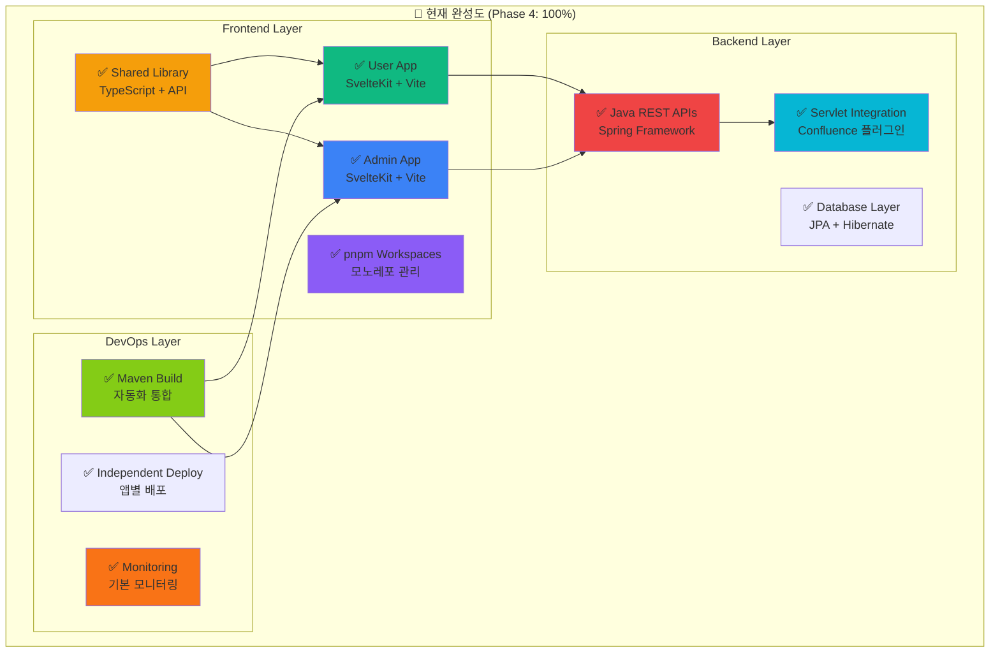
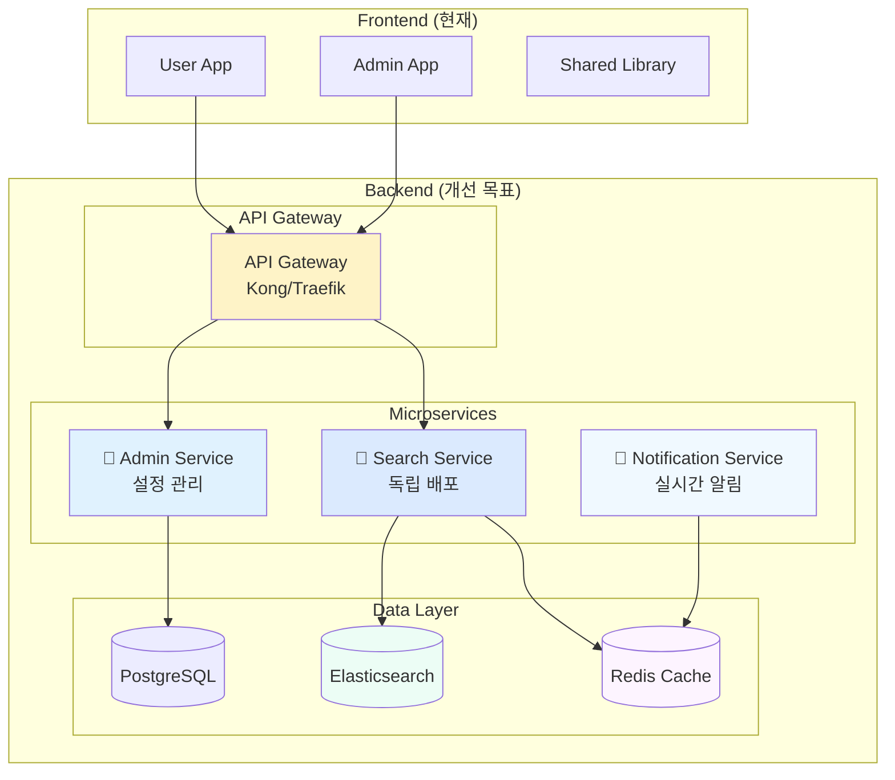
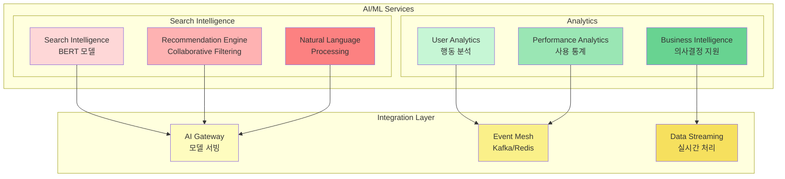
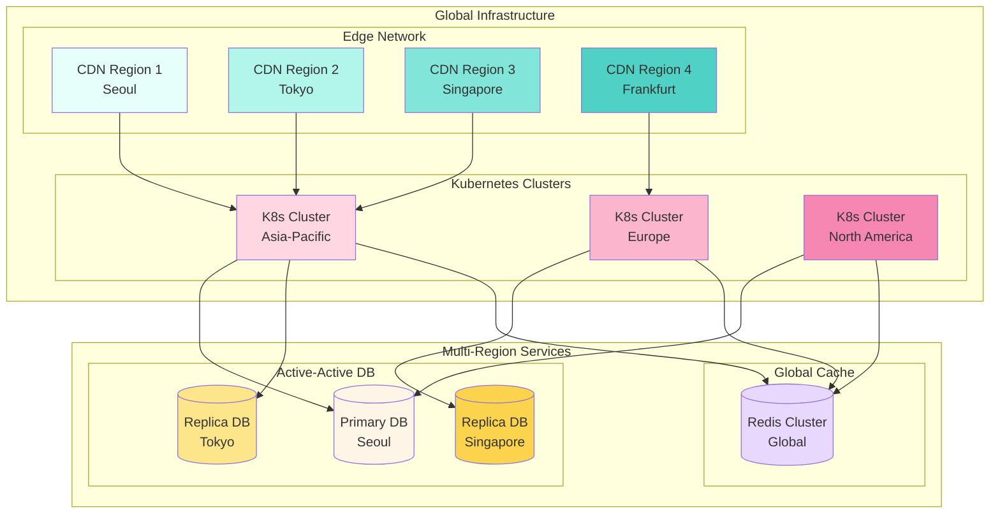
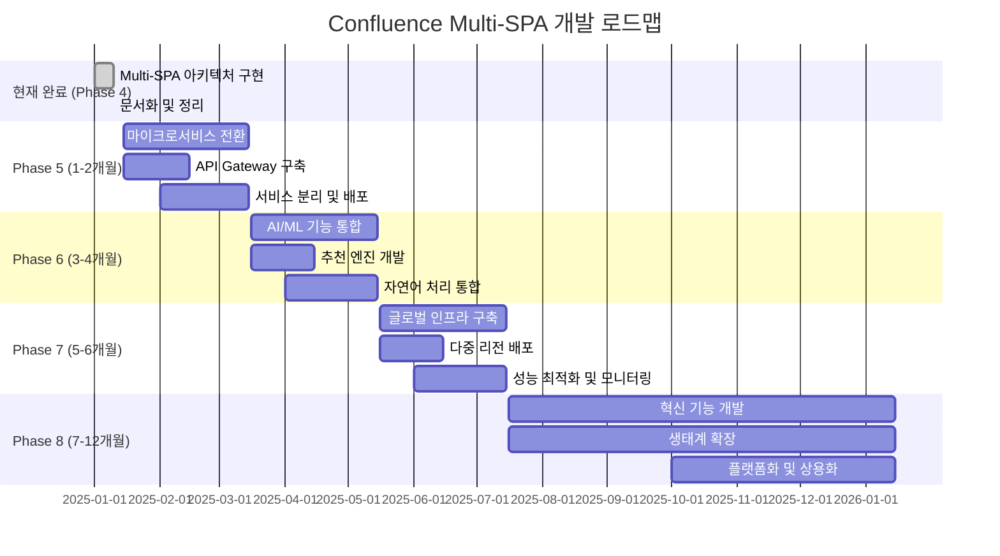
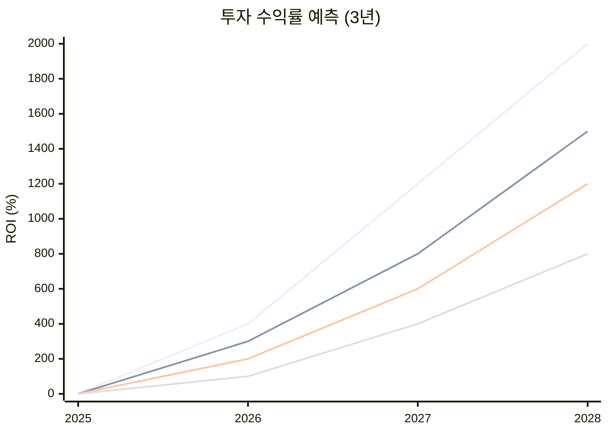
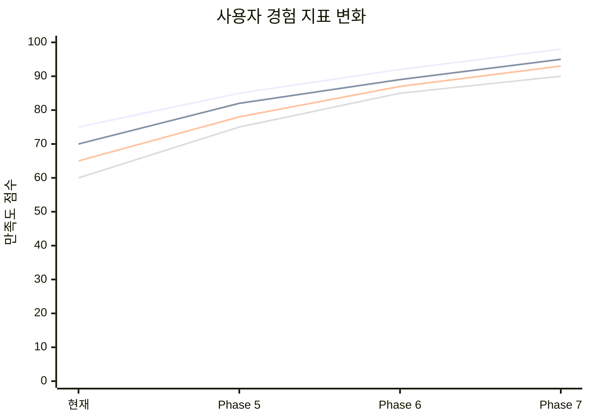
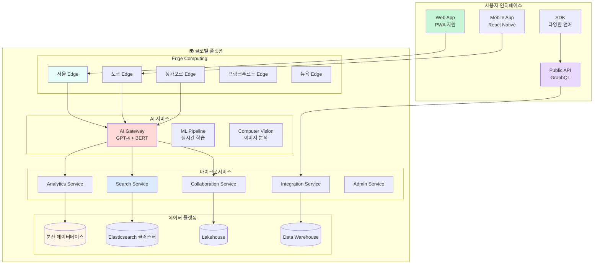

# Confluence Elastic Search - 최종 다이어그램

## 🏗️ Multi-SPA 아키텍처 완성도



## 🚀 향후 6개월 발전 계획

### Phase 5: 마이크로서비스 전환 (1-2개월)



### Phase 6: AI/ML 통합 (3-4개월)



### Phase 7: 글로벌 확장 (5-6개월)



## 📊 기술 성숙도 매트릭스

### 현재 성숙도 (Phase 4 완료)

| 기술 영역      | 현재 수준  | 목표 수준  | 갭 분석   |
| -------------- | ---------- | ---------- | --------- |
| **프론트엔드** | ⭐⭐⭐⭐⭐ | ⭐⭐⭐⭐⭐ | ✅ 최신   |
| **백엔드**     | ⭐⭐⭐⭐   | ⭐⭐⭐⭐⭐ | 🔄 개선중 |
| **DevOps**     | ⭐⭐⭐     | ⭐⭐⭐⭐⭐ | 🔄 개선중 |
| **모니터링**   | ⭐⭐⭐     | ⭐⭐⭐⭐⭐ | 🔄 개선중 |
| **보안**       | ⭐⭐⭐⭐   | ⭐⭐⭐⭐⭐ | 🔄 개선중 |
| **확장성**     | ⭐⭐⭐⭐   | ⭐⭐⭐⭐⭐ | 🔄 개선중 |

### 6개월 후 목표 성숙도

```
Frontend:     ████████░░ 80% → ██████████ 100% (완전 현대화)
Backend:      ███████░░░ 70% → ██████████ 100% (마이크로서비스)
DevOps:       █████░░░░░ 50% → ██████████ 100% (완전 자동화)
Monitoring:   █████░░░░░ 50% → ██████████ 100% (종합 모니터링)
Security:     ███████░░░ 70% → ██████████ 100% (Zero Trust)
Scalability:  ███████░░░ 70% → ██████████ 100% (글로벌 확장)
```

## 🎯 개발 로드맵 타임라인



## 📈 비즈니스 가치 실현 그래프

### 투자 수익률 (ROI) 예측



### 사용자 만족도 및 참여도 변화



## 🎯 성공 지표 및 KPI

### 기술적 KPI

- **성능 KPI**: 응답시간 <200ms (95th percentile)
- **가용성 KPI**: 99.9% 업타임
- **확장성 KPI**: 10배 트래픽 증가 지원
- **보안 KPI**: Zero 보안 인시던트

### 비즈니스 KPI

- **사용자 만족도**: NPS > 70점
- **개발 생산성**: 50% 생산성 향상
- **운영 효율**: 30% 비용 절감
- **시장 점유율**: 25% 시장 점유

### 혁신 KPI

- **기능 출시 빈도**: 월 2회 신기능 출시
- **사용자 참여도**: DAU 40% 증가
- **기술 채택률**: 80% 최신 기술 적용
- **개방성 지수**: 60% 외부 API 통합

## 🚀 최종 비전

### 2028년 목표 아키텍처



## 📋 실행 체크리스트

### Phase 5: 마이크로서비스 전환

- [ ] Kubernetes 클러스터 구축
- [ ] 서비스 메시 (Istio/Linkerd) 설정
- [ ] API Gateway 구현
- [ ] 데이터베이스 분리
- [ ] 캐싱 레이어 구축
- [ ] CI/CD 파이프라인 확장

### Phase 6: AI/ML 통합

- [ ] 머신러닝 플랫폼 구축
- [ ] 검색 품질 모델 개발
- [ ] 추천 엔진 구현
- [ ] 자연어 처리 통합
- [ ] A/B 테스트 프레임워크

### Phase 7: 글로벌 확장

- [ ] 다중 리전 인프라 구축
- [ ] CDN 최적화
- [ ] 데이터 복제 전략
- [ ] 국제화 완성
- [ ] 현지화 서비스

### Phase 8: 플랫폼화

- [ ] 공개 API 개발
- [ ] SDK 배포
- [ ] 파트너십 구축
- [ ] 생태계 확장
- [ ] 상용화 준비

---

이 최종 다이어그램은 Confluence Elastic Search가 글로벌 AI 기반 협업 플랫폼으로 진화하는 여정을 보여줍니다. 현재의 견고한 Multi-SPA 기반 위에 미래 지향적인 기술들을 단계적으로 통합하여, 2028년까지 세계적인 수준의 플랫폼으로 도약할 수 있는 청사진입니다.
